# Codex 使用教程

>  Codex 英文文档：https://developers.openai.com/codex   
Codex 中文文档：https://www.codex-docs.com/

<hr style="border: none; height: 2px; background: linear-gradient(to right, transparent, #007bff, transparent);">

## 零、前言

### 0.1 什么是 Codex

Codex 是 OpenAI 推出的 AI 编程智能体，能够理解项目代码、修改文件、运行命令、执行测试，并协助用户完成从需求分析到代码实现、调试、审查和交付的开发流程。
它可以在本地项目、云端环境或集成开发工具中工作，根据用户的目标逐步阅读上下文、制定方案、修改代码，并给出可验证的结果。

### 0.2 Codex 有哪些应用场景

Codex 可以辅助软件开发，包括开发新功能、修复错误、优化代码、补充测试、解释陌生项目、生成脚本和审查代码。除此之外，Codex 也可以完成很多非纯代码任务。例如整理资料、撰写文档、制作表格、生成幻灯片、处理图片、搭建网页原型、自动化重复操作等。

### 0.3 安装并登录 Codex App

>https://developers.openai.com/codex/quickstart

在开始安装之前，需要先了解一下：Codex 有多种使用入口，包括 App、IDE Extension、CLI 和 Cloud。

其中，**Codex App** 是独立桌面应用，适合大多数新手入门；**IDE Extension** 适合在编辑器中边写代码边使用；**CLI** 适合命令行用户；**Cloud** 则适合在云端执行更复杂或耗时的任务。

本教程主要讲解 **Codex App**。它更直观，也更容易展示 Codex 如何读取项目、修改文件、运行命令和完成任务。

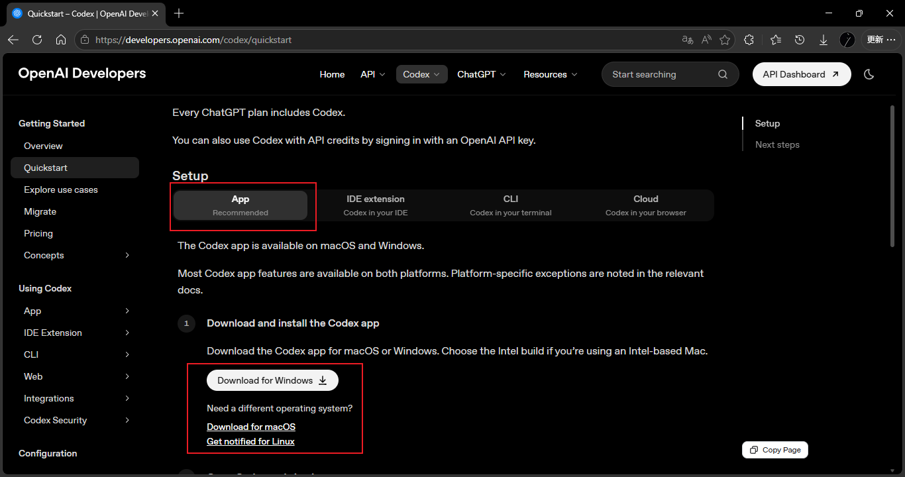

在这里选择 `App`，然后选择与你操作系统对应的版本进行下载。

安装完毕并登录 Codex App 后，你可以看到下面的界面，其详细功能将在下面的章节中介绍。

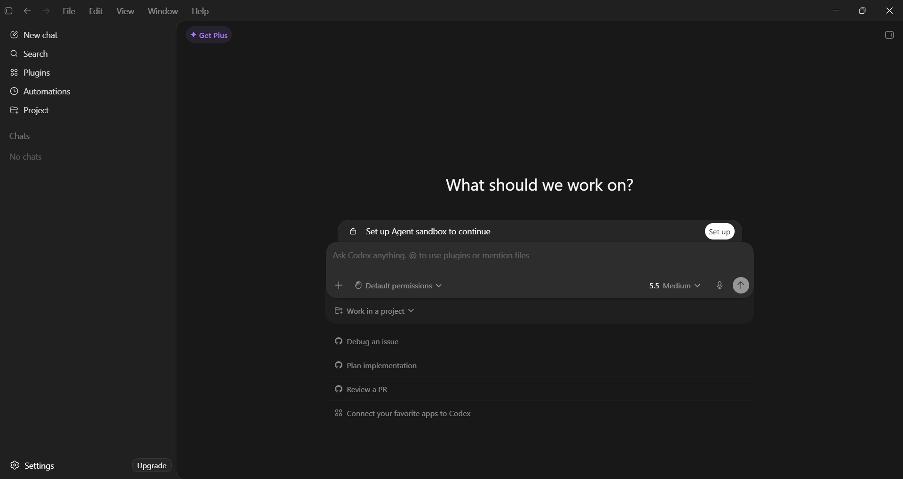

<hr style="border: none; height: 2px; background: linear-gradient(to right, transparent, #007bff, transparent);">

## 一、Project

### 1.1 引入 Project

在界面左侧的功能区中，你可以看到 `Project`，点击 `Project`，会出现 `从零开始` 和 `使用一个以存在的文件夹`，我已经创建了一个名为 `Codex Desktop Research` 的文件夹，所以在这里我将选择后者。

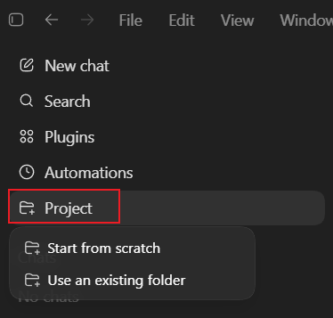

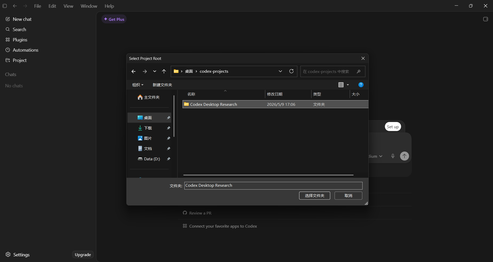

引入成功后，可以看到我们的项目已经进入了项目列表，当然你可以在项目列表中引入多个项目。

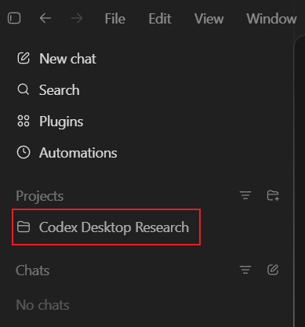

同时，你也可以使用拖动的方式引入项目。

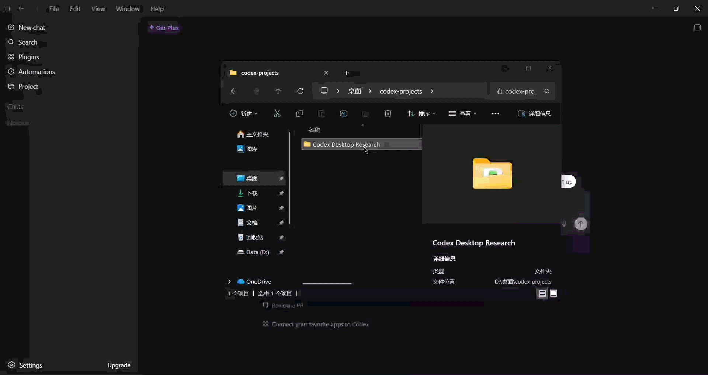

### 1.2 移除 Project

你也可以从项目列表中移除项目，点击 `...`，然后选择 `Remove`，当然这并不会将你的项目从磁盘中删除。

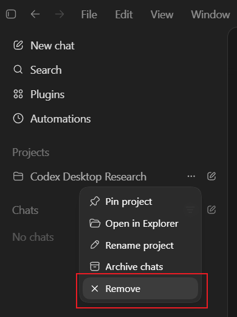

### 1.3 固定 Project
当你选择 `Pin project` 时，项目会被固定到 `Pinned` 列表。

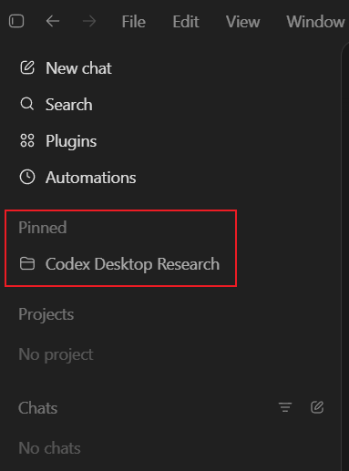

### 1.4 在文件管理器中打开 Project

当你选择 `Open in Explorer` 时，顾名思义，你的项目将被在文件管理器中打开。

### 1.5 重命名 Project

`Rename project` 功能仅会修改你的项目在项目列表中的名字，并不会修改你的项目文件夹的名字。

### 1.6 归档 chats

点击 `Archive chats` 后，所有的聊天会从列表里移走，但不会被删除（ `chat` 会在下一个章节中讲到）。

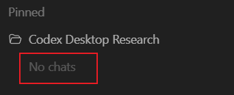

你可以在 `Settings` -> `Archived chats` 中找到被归档的对话，然后取消归档，这样被归档的对话就会重新回到列表中。当然你也可以仅归档其中一个 chat，你需要先创建一个 chat，然后右键想要归档的 chat，点击归档对话，这里就不做演示了，你可以自己尝试。

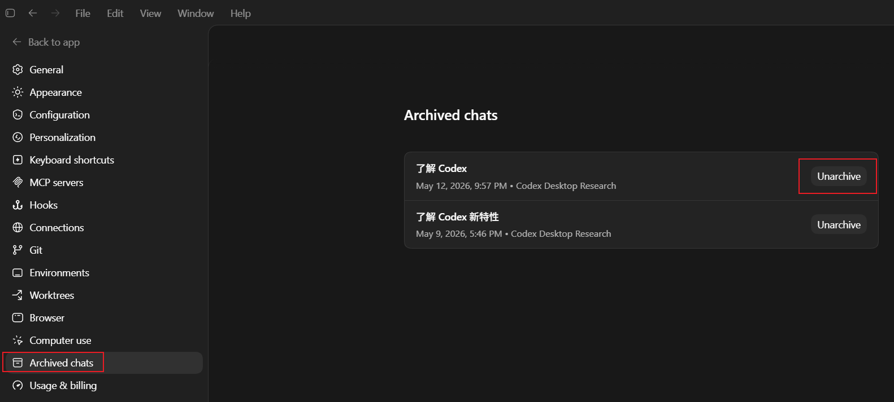

<hr style="border: none; height: 2px; background: linear-gradient(to right, transparent, #007bff, transparent);">

## 二、Chat（Thread）

> 在一些文档中 Chat 与 Thread 是同义词。

### 2.1 创建 Chat 

在界面左侧，有三个位置可以创建 chat。

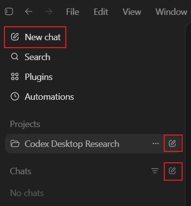

点击创建 chat 后，你可以选择让这个 chat 归属于哪一个 project。当然，你也可以不在任何项目中创建 chat。

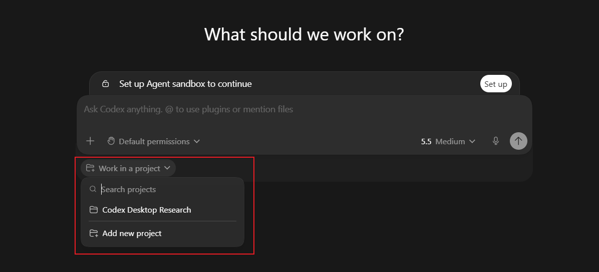

如果你选择不在项目中进行的对话，这些对话会被放在最下面的 `Chats` 中。

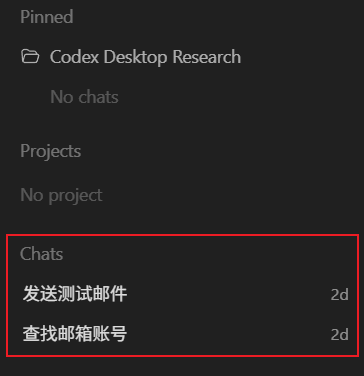

在这里我们选择在上一个章节引入的 `Codex Desktop Research` 项目。

接下来，我们进行第一次对话。

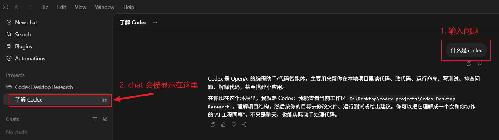

可以看到，这个 chat 位于 `Codex Desktop Research` 项目下，并且 Codex 为这个 chat 总结了一个标题。

### 2.2 并行执行

如果我们在这个项目中再次创建一个 chat，并与新创建的 chat 进行对话，可以看到多个任务是可以并行执行的。

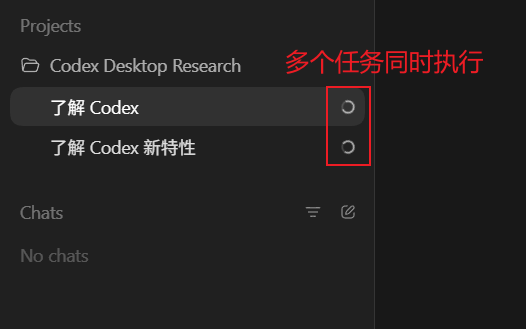

另外，对话执行完成后会有蓝色小圆点提示。

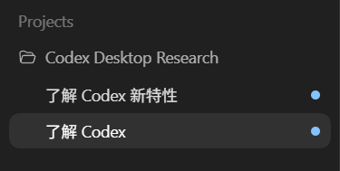

### 2.3 搜索 Chat

你可以搜索 chat，注意到界面左上角有一个 `Search` 选项，单机这个选项，然后输入你想搜索的 chat 的标题，选择你的目标 chat。

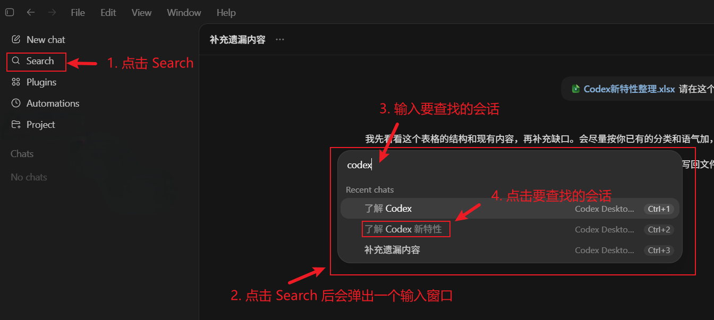

### 2.4 Deeplink

右键单击对话，你可以看到除了一些基本操作外，有一个 `Copy session ID` 选项，和一个 `Copy deeplink` 选项。

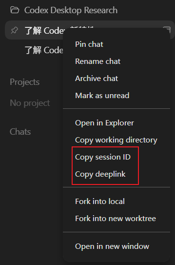

其中 `Session ID` 是这个聊天会话的唯一编号，一般情况下你并不会用到它。

`Deeplink` 是这个会话的直达链接，其形式是这样的：`codex://threads/这里是 Session ID`。

你可以将这个 deeplink 复制到浏览器，或按 `Win + R` 并粘贴这个链接后回车，你会发现 Codex app 会跳转到这个会话。

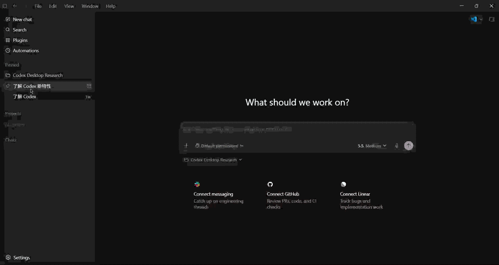

另外你可能注意到下面还有两个选项，`Fork into local` 和 `Fork into new worktree`，这两个选项将会在之后的章节中讲到。

<hr style="border: none; height: 2px; background: linear-gradient(to right, transparent, #007bff, transparent);">

## 三、输入框

接下来我们将视角移到我们的第一次对话的输入框。

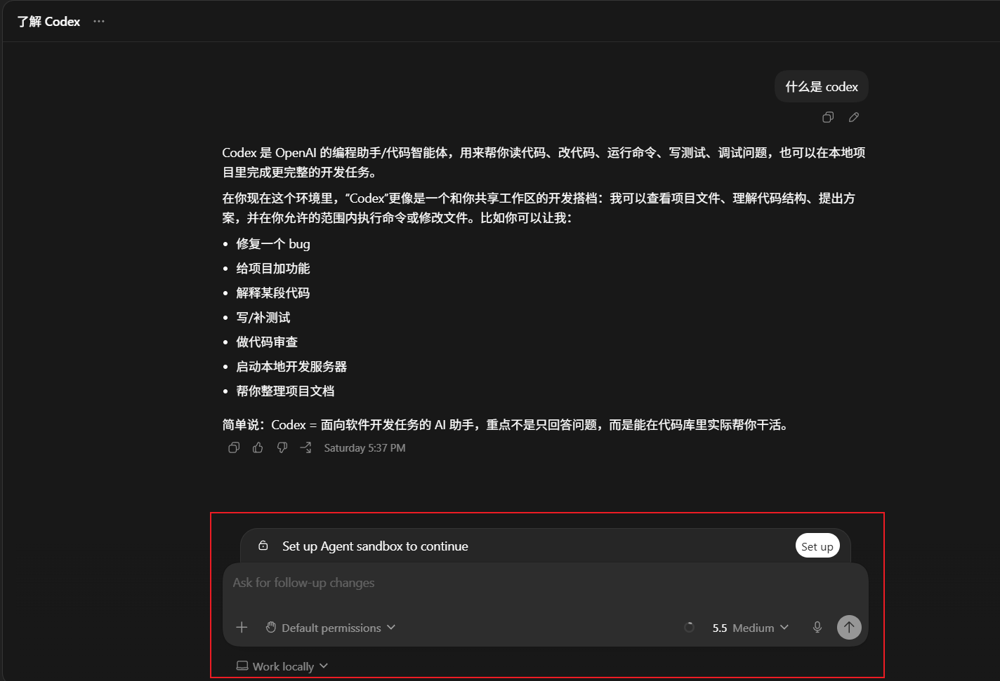

### 3.1 模型选择与推理强度

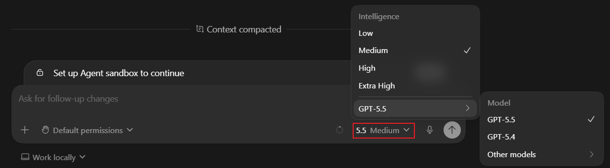

你可以根据任务的复杂程度来选择合适的模型与推理强度，当然，更强的模型与更高的推理强度往往意味着要消耗更多的 Token 额度。

你可以在页面的左下角的 `Settings` 中查看自己的剩余额度。

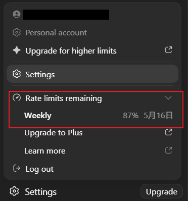

### 3.2 上下文窗口

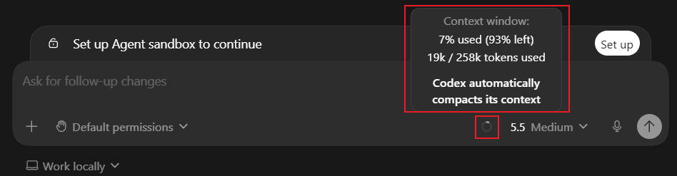

在上图中，我们可以看到当前的这个 chat 的历史对话内容已经占用了 7% 的模型上下文空间，还剩余 93% 的模型上下文空间。当上下文超过限制的时候，Codex 会自动对历史对话进行压缩，从而释放更多的上下文空间。

进行上下文压缩能够将对话信息中不重要的内容排除掉，进而提高 AI 专注力，降低 Token 消耗。

我们也可以手动进行上下文压缩，输入 `/Compact`，然后选择 `Compact`。

> 在 Codex 中，输入 `/` 会触发斜杠命令（Slash Commands），这是 Codex CLI、桌面应用和 IDE 扩展中的键盘优先控制方式，让你无需离开聊天输入框，就能直接控制 Codex。
>
> 如果你想了解更多的斜杠命令，参见：
>
>  https://www.codex-docs.com/using-codex/app/commands/
>
> https://www.codex-docs.com/using-codex/cli/slash-commands/
>
> https://www.codex-docs.com/using-codex/ide/slash-commands/

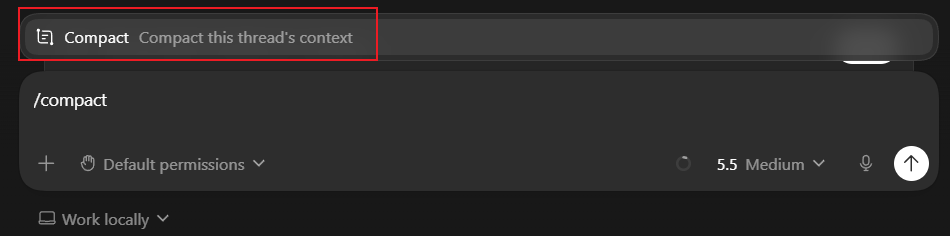

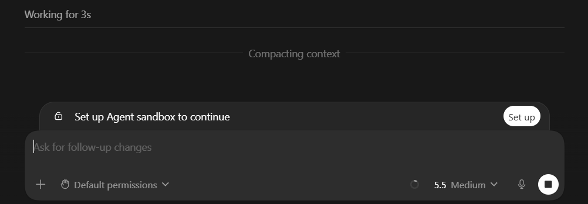

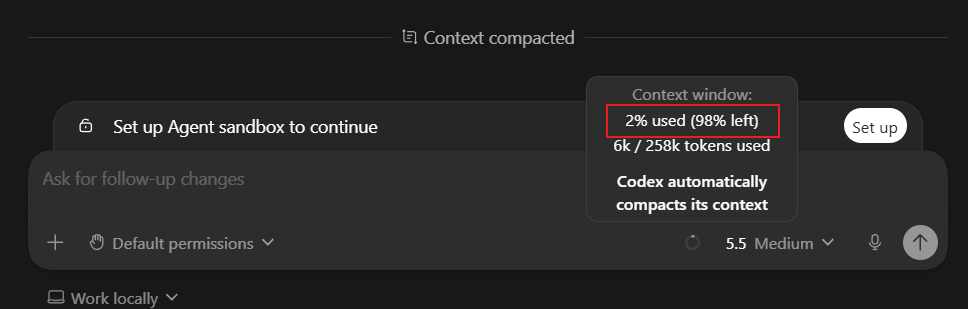

上下文压缩完毕后，我们可以看到上下文空间增加到了 98% 。

### 3.3 权限控制

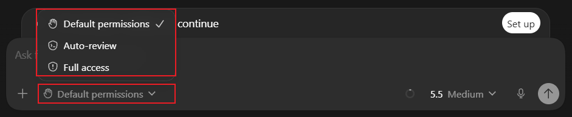

在使用 Codex App 时，权限控制决定了 Codex 能在你的电脑上做到什么程度。它既要让 Codex 可以帮你读文件、改代码、运行命令，又要避免它在没有确认的情况下访问不该访问的位置、安装依赖、联网，或者执行其它高风险操作。

可以把 Codex 的权限控制理解成两层：

1. **沙箱模式（Sandbox Mode）**：决定 Codex 能访问和修改哪些内容。
2. **审批策略（Approval Policy）**：决定 Codex 在什么时候需要先征求你的同意再进行操作。

#### 3.3.1 沙箱模式

沙箱是 Codex 的工作边界。当 Codex 在读取文件、修改代码、运行命令时，它默认会受到沙箱的限制，而不是直接拥有你整台电脑的完整权限。

沙箱会限制 Codex 可以做什么，例如：

- 能否修改当前项目之外的文件
- 能否访问网络
- 能否写入某些受保护的位置
- 能否运行可能影响系统环境的命令

默认情况下，Codex 主要在当前项目范围内工作。也就是说，它可以读取和修改当前项目中的文件，但如果要访问项目外的路径，或者进行联网操作，通常就需要额外确认。

这样做的好处是低风险的项目内操作可以顺利推进，而高风险或超出项目范围的操作会被拦下来，让你决定是否允许。


你可能已经注意到 `Set up Agent sandbox to continue` 这个选项，它在告诉我们表示需要先为 Agent 配置一个受限的执行环境，之后它才能继续完成涉及文件读取、代码修改、命令运行或测试执行等操作。即使尚未完成设置，用户通常仍可继续进行普通对话。但当任务需要 Agent 实际操作项目时，就需要先完成 sandbox 配置。

#### 3.3.2 审批策略

审批策略决定 Codex 在遇到哪些操作时必须先询问你。

例如，当 Codex 需要安装依赖、访问网络、修改沙箱外的文件，或者运行某些不在默认信任范围内的命令时，Codex 会弹出审批请求。你可以在审批时看到 Codex 想执行什么操作，以及它为什么需要这样做。


如果你同意，Codex 就会继续执行；如果你拒绝，它就需要换一种方式完成任务，或者向你说明当前任务为什么无法继续。

#### 3.3.3 切换权限模式

在 Codex App 中，你可以通过输入框附近的权限选择器调整当前 Chat 的权限模式。


对刚开始使用 Codex 的用户来说，建议先使用默认权限。默认权限已经足够完成大多数项目内的代码阅读、修改和运行命令，同时也能在涉及网络、项目外文件或更高风险操作时提醒你确认。

你可以通过 `config.toml` 进行更细致的自定义配置。相关文档可以参考：

https://www.codex-docs.com/getting-started/concepts/sandboxing/

https://www.codex-docs.com/configuration/permissions/


### 3.4 文件引用

在这里我让 Codex 在 `Codex Desktop Research` 文件夹下生成了一个文件，我们可以使用 `@` 符号在输入框中引用这个文件。

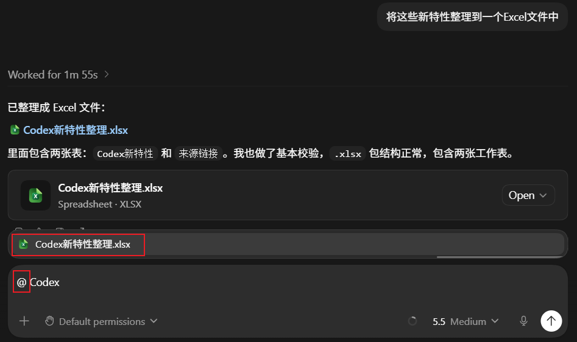


### 3.5 其它

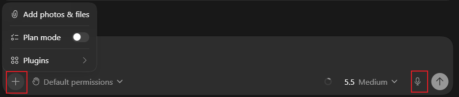

点击左边的 `+` 后，在弹出的选项框中可以看到，你可以添加附件、开启计划模式，以及使用插件。

> 计划模式和插件将在后续的章节中讲到。

另外，你会注意到输入框的右边有一个麦克标志，你可以选择语音输入。

<hr style="border: none; height: 2px; background: linear-gradient(to right, transparent, #007bff, transparent);">

## 四、Skill 

### 4.1 什么是 Skill

Skill 本质上是一个带有 SKILL.md 说明文件的可复用文件包，可以用来固化流程、规范和多步骤工作方法，告诉 Codex 某一类任务应该怎么做。

当我们平时和 Codex 进行对话时，很多要求只在当前这一次对话中生效。而如果这些要求会反复出现，每次都重新说明就比较麻烦。这时就可以把它们整理成一个 Skill，让 Codex 在遇到对应任务时自动参考。

### 4.2 创建并使用 Skill

来看这个示例，这里我让 Codex 帮我做一个处理 SVG 图片的操作。

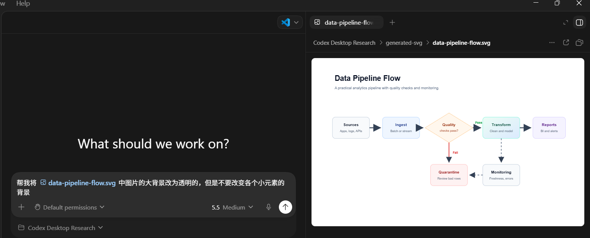

在几轮对话后，图片已经达到了我预期的效果。

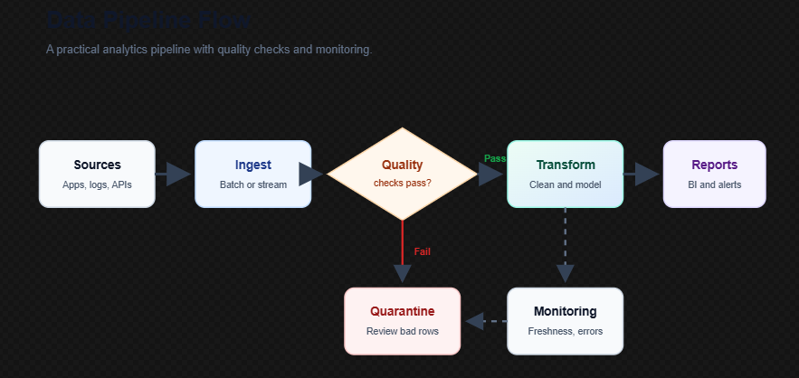

在未来我很可能再次让 Codex 做这样的工作，所以我让 Codex 帮我将这个流程创建为一个 skill。

可以看到，Codex 已经帮我创建了一个名为 `svg-transparent-background` 的 skill。

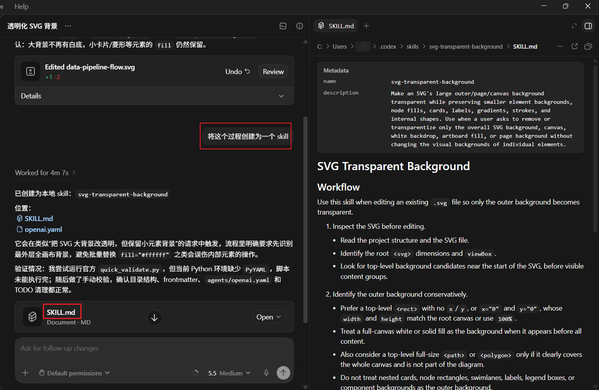

可以在 `Plugins` -> `Skills` 中找到这个新创建的 skill。

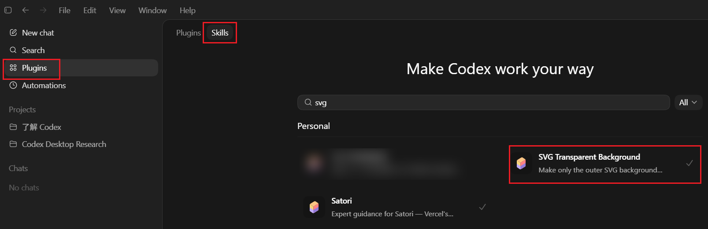

你可以使用 `$` 来使用这个 skill。

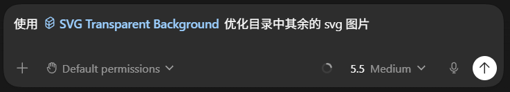

### 4.3 使用第三方的 Skill

除了使用自己创建的 skill 之外，我们还可以使用第三方的 skill。在这里我将演示一个制作 ppt 的第三方 skill。

我们先在 github 中下载这个 skill 的压缩包。

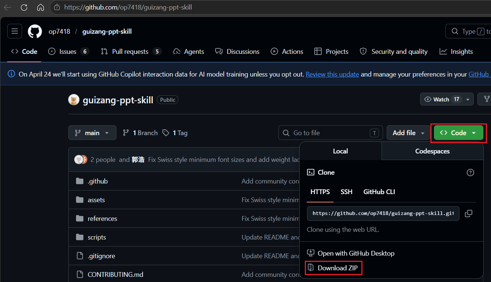

在项目目录中创建 `.codex` 文件夹，再在其中创建 `skills` 文件夹，并将压缩包解压后放在 `skills` 文件夹中。

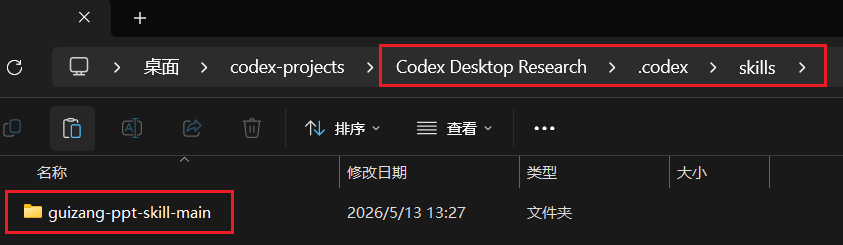

这样你就可以使用这个 skill 了，你可以让 Codex 帮你生成一个介绍 Codex app 的 HTML PPT。

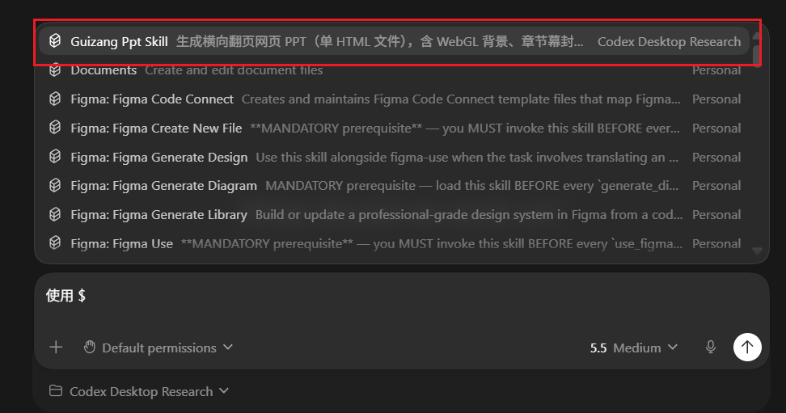

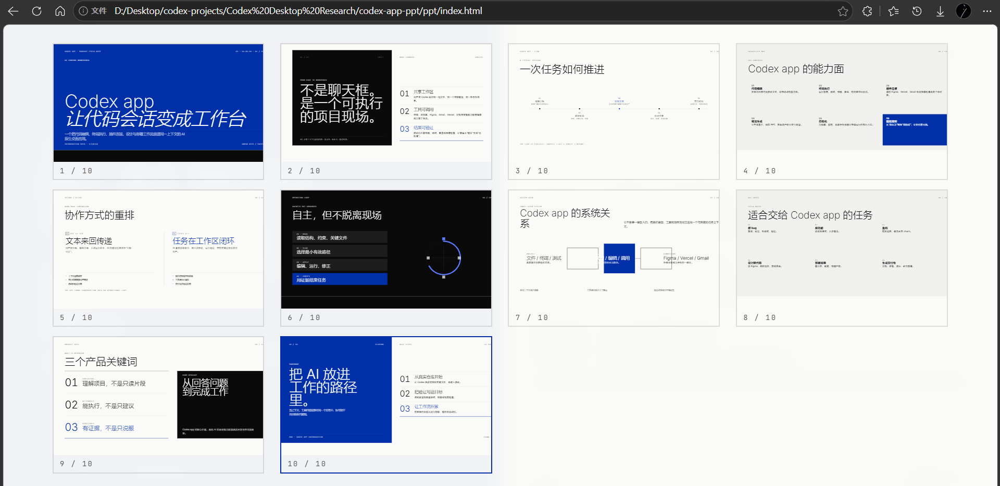


>在下面的章节，我们将做一个简单的 web 应用，来展示 Codex App 的功能。你可以先创建好一个名为 `appointment-demo` 的文件夹，并把它添加到 Codex App 的 Project 中。

<hr style="border: none; height: 2px; background: linear-gradient(to right, transparent, #007bff, transparent);">

## 五、全局自定义指令（Custom Instructions）

我们需要先了解一下 Codex App 中的 `全局自定义指令（Custom Instructions）`。

它位于：`Settings → Personalization → Custom instructions`

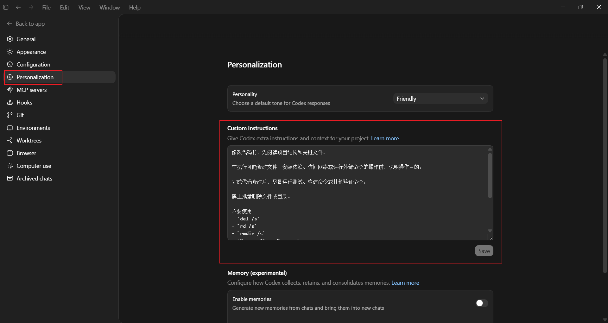

这里填写的内容会作为 Codex 的全局行为偏好，影响之后所有项目、所有 Chat 中 Codex 的回答方式和工作习惯。

以下内容适合写入全局自定义指令中：

- 默认使用什么语言回答
- 希望解释详细还是简洁
- 修改代码前是否先阅读项目
- 修改完成后是否运行测试或构建
- 遇到权限申请时是否解释原因
- 前端开发时的通用 UI 偏好

例如我们可以这样设置：

```
修改代码前，先阅读项目结构和关键文件。

在执行可能修改文件、安装依赖、访问网络或运行外部命令的操作前，说明操作目的。

完成代码修改后，尽量运行测试、构建命令或其他验证命令。

禁止批量删除文件或目录。

不要使用： 
- `del /s`
- `rd /s`
- `rmdir /s` 
- `Remove-Item -Recurse`
- `rm -rf` 

需要删除文件时，只能一次删除一个明确路径的文件。

正确示例： Remove-Item "C:\path\to\file.txt" 

如果需要批量删除文件,应停止操作,并向用户请求,让用户手动删除。
```

记住，这个设置是面向你所有的项目的，所以全局自定义指令不适合写某个具体项目的细节。对于具体某个项目的说明，你可以将它写到 `AGENTS.md` 文件中，你将在下面的一节中看到。

<hr style="border: none; height: 2px; background: linear-gradient(to right, transparent, #007bff, transparent);">

## 六、AGENTS.md

### 6.1 什么是 `AGENTS.md`
`AGENTS.md` 是写给 Codex 看的项目说明文件。你可以把它理解成给 AI 编程助手看的 README。普通的 `README.md` 主要写给人看，介绍项目是什么、怎么运行、怎么使用；而 `AGENTS.md` 主要写给 Codex 这类编码智能体看，用来告诉它：

- 这个项目使用什么技术栈
- 项目应该如何安装依赖、启动、测试、构建
- 代码应该遵守什么风格
- 哪些文件可以修改，哪些文件不要随便动
- 遇到任务时应该优先遵循哪些项目规则

当 Codex 进入一个项目工作时，会读取这些说明，从而更准确地理解项目背景，减少反复解释。

### 6.2 为什么要在项目开始前创建 `AGENTS.md`

在使用 Codex 创建或修改项目之前，最好先准备一个 `AGENTS.md`。这样做的好处是：你不需要在每一次对话里重复告诉 Codex “这个项目用 React”、“运行命令是 npm run dev”等规则。

例如，如果我们要做一个预约信息收集的 Web 应用，可以提前告诉 Codex：

- 前端使用 React + Vite
- 数据库使用 Supabase
- 样式保持简洁
- 表单需要做基础校验
- 不要把 Supabase 密钥写死在代码中
- 修改完成后运行构建命令检查项目是否正常

这样 Codex 在后续执行任务时，就会把这些规则当作项目上下文来参考。

### 6.3 AGENTS.md 应该放在哪里

最常见的做法是把它放在项目根目录：

```
appointment-demo/
├─ AGENTS.md
├─ package.json
├─ src/
└─ ...
```

如果项目很大，也可以在不同子目录下放不同的 `AGENTS.md`。例如前端目录有前端规则，后端目录有后端规则。

### 6.4 AGENTS.md 示例

```
# AGENTS.md

## Project Overview

This is a simple appointment collection web app for a Codex App tutorial.

The app allows users to submit appointment information through a web form, and stores the submitted data in Supabase.

## Tech Stack

- React
- Vite
- Supabase
- JavaScript
- CSS

## Commands

- Install dependencies: `npm install`
- Start development server: `npm run dev`
- Build project: `npm run build`

## Development Rules

- Keep the app simple and suitable for a beginner tutorial.
- Do not add unnecessary frameworks or complex architecture.
- Use environment variables for Supabase configuration.
- Do not hard-code secrets or API keys in source code.
- Keep components small and easy to understand.
- Add basic form validation for required fields.
- After code changes, run `npm run build` to check whether the project can build successfully.

## UI Requirements

- The first screen should be the actual appointment form.
- Do not create a marketing landing page.
- The interface should be clean, simple, and easy to explain in a tutorial.
- Show a clear success message after the form is submitted.

## Database Notes

The main table is `appointments`.

Expected fields:

- `id`
- `name`
- `contact`
- `service`
- `appointment_date`
- `appointment_time`
- `note`
- `status`
- `created_at`
```

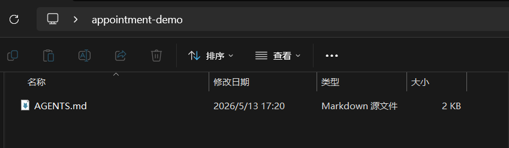

<hr style="border: none; height: 2px; background: linear-gradient(to right, transparent, #007bff, transparent);">

## 七、Git

在准备好全局自定义指令和 AGENTS.md 后，建议先为项目初始化 Git 仓库，在 Codex 中需要先创建 Git 仓库后才能进行 undo 操作。

> 有关 Git 的操作在本教程中并不做赘述，读者可以阅读《 Head First Git 》这本书，或者查看其它教程。

你可以在经过一次对话中点击有上角的 `Toggle terminal`打开终端，或者直接使用快捷键 `Ctrl + J`

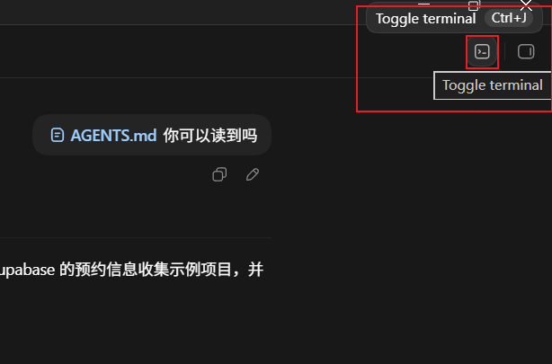

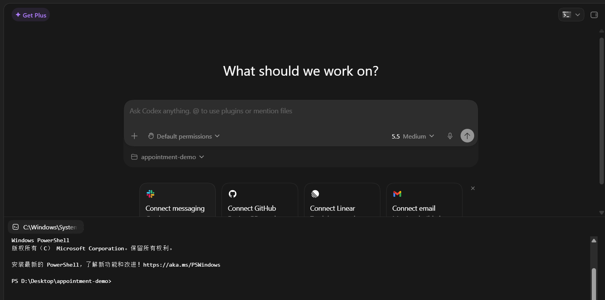

你可以在终端中输入 `git init` 来初始化一个本地仓库。


当然接下来，你可以直接告诉 Codex 来如何做。例如，你可以告诉 Codex：帮我创建一个基础的 gitignore 文件，并将它提交到本地仓库中。

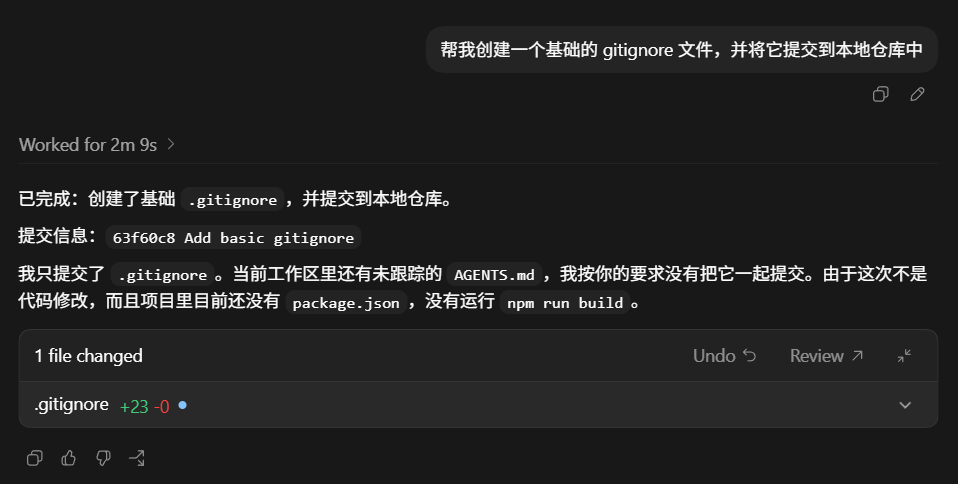

<hr style="border: none; height: 2px; background: linear-gradient(to right, transparent, #007bff, transparent);">

## 八、Plan Mode


在真正让 Codex 修改文件之前，可以先让 Codex 进入 Plan mode，帮助我们拆解需求、确认技术方案和开发步骤。Plan mode 很适合作为从准备工作进入正式开发之间的过渡环节。

我们开启 Plan mode 后，可以输入：

```
我想创建一个简单的预约信息收集 Web 应用，用于展示 Codex App 的开发能力。

请先不要写代码，先帮我制定开发计划，包括：
1. 应用需要哪些页面
2. 表单需要哪些字段
3. Supabase 数据库需要哪些表
4. 第一版实现哪些最小功能
5. 暂时不做哪些复杂功能
6. 开发步骤应该如何安排
```

下面是 Codex 生成的计划的一部分。

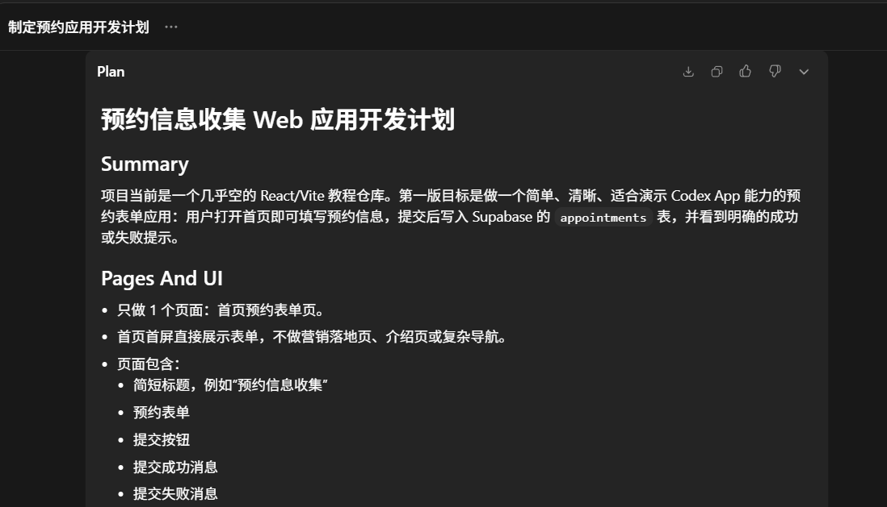

Codex 生成计划后会向你确认是否同意这个计划，你可以在查看其计划决定是否同意。

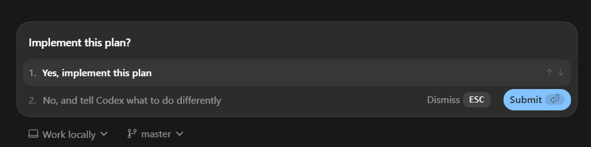

如果你点击 `Submit` 同意这个计划，Codex 会关闭计划模式，并开始执行这个计划。

<hr style="border: none; height: 2px; background: linear-gradient(to right, transparent, #007bff, transparent);">

## 九、内置浏览器

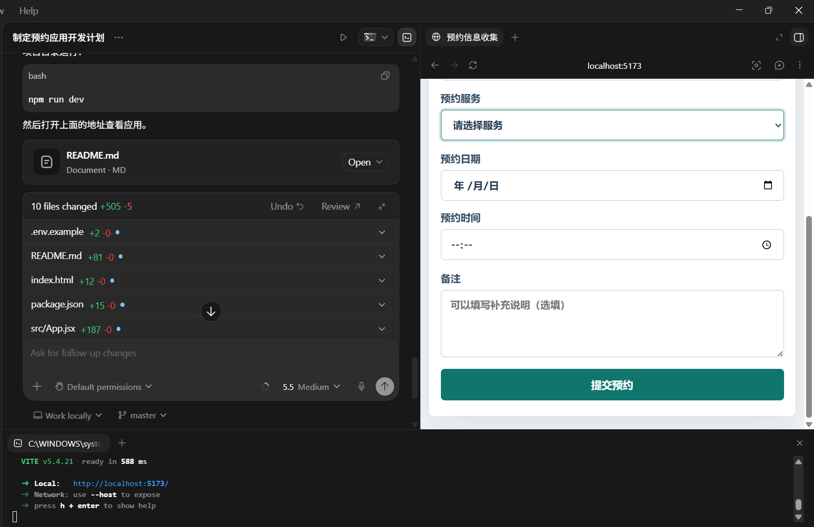

Codex 已经按照我们的计划完成了应用的创建，我们启动应用后点击应用的地址，在这里是 `http://localhost:5173/`。点击后我们可以发现，Codex App 在右侧使用其内置浏览器打开了我们的应用。

### 9.1 什么是内置浏览器

Codex App 的内置浏览器可以用来打开和预览本地运行的 Web 应用，这样你不需要切换到外部浏览器，就可以直接在 Codex App 中查看页面效果。

需要注意的是，Codex 内置浏览器并不等同于完整的日常浏览器，不支持认证流程、已登录页面、你的常规浏览器配置档案、cookies、扩展或已有标签页。

### 9.2 浏览器 Annotate 功能

内置浏览器还支持对页面进行 annotate。我们可以在页面上的某个具体位置或区域添加 annotation，然后让 Codex 根据这些反馈继续修改页面。

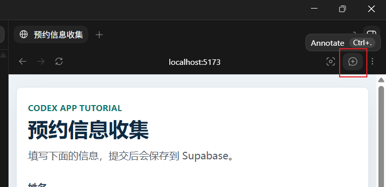

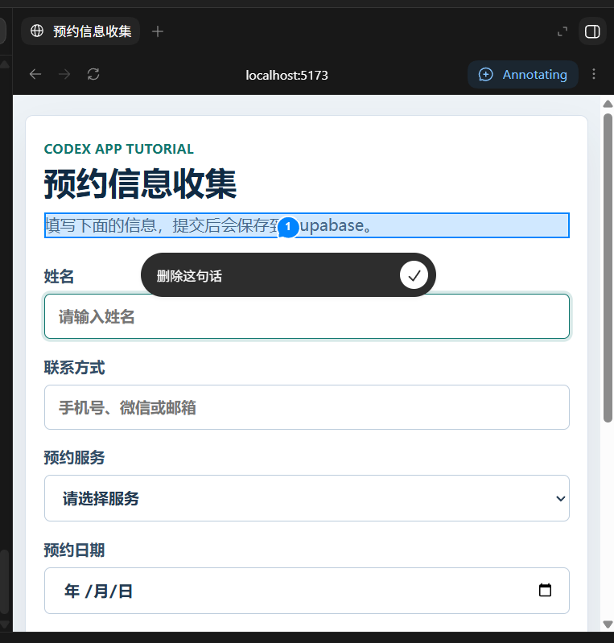

点击后面的对号后，这条 annotation 会被添加到对话区。

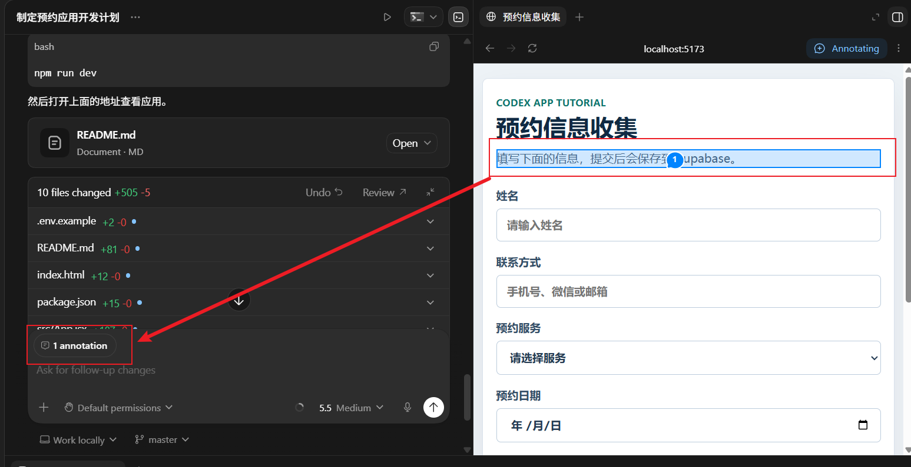

我们提交这次对话后，Codex 会对这个 annotation 进行处理。

可以看到，我们要求删除的部分已经被成功删除了。

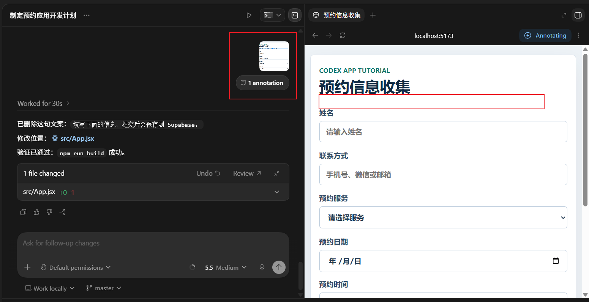

<hr style="border: none; height: 2px; background: linear-gradient(to right, transparent, #007bff, transparent);">

## 十、Steer

在 Codex 执行任务时，我们可以在任务没有完成时发出新的命令。如果发现它的实现方向和预期不完全一致，可以直接在当前对话中补充新的要求，而不是等 Codex 完成后再整体返工。这个过程可以理解为 Steer，也就是引导 Codex 调整方向。

默认情况下，如果 Codex 正在执行一个任务，你在输入框里继续发送消息，这条新消息会进入排队，等当前任务完成后再处理。而 Steer 让你在 Codex 仍然执行当前任务时，把新的指令作为方向调整尽快插入进去，让 Codex优先参考这条新要求继续执行。

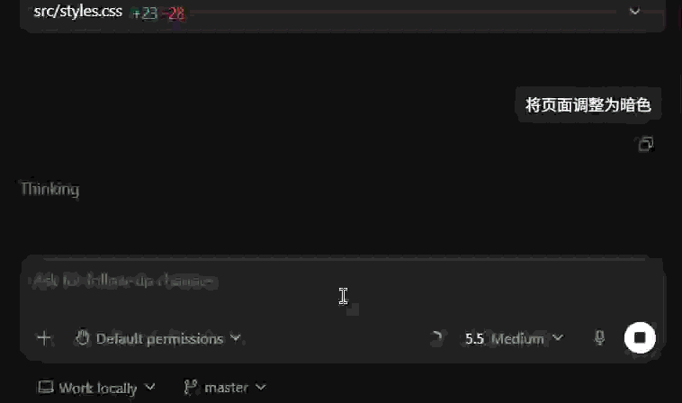

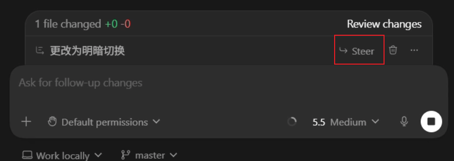

如果你希望你的新命令能够被立即响应，不需要手动点击 `Steer`，那么你可以在 `Settings` -> `General` -> `Follow-up behavior` 中选择 `Steer`。

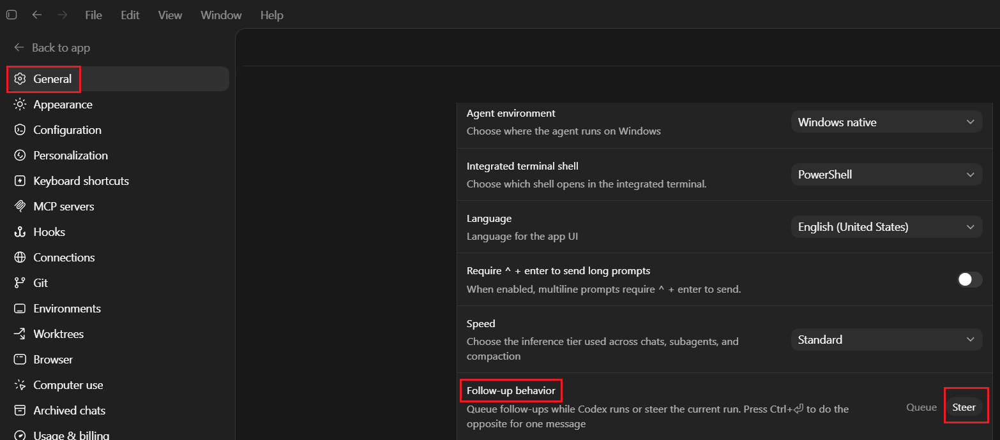

<hr style="border: none; height: 2px; background: linear-gradient(to right, transparent, #007bff, transparent);">

## 十一、MCP （TODO）

### 11.1 什么是 MCP

MCP 的全称是 Model Context Protocol，可以理解为一种让 Codex 连接外部工具和数据源的协议，它规定了外部工具、数据源、服务应该如何把能力提供给 Codex 这类 AI 智能体使用。

MCP Server 是按照 MCP 协议实现的具体服务，它负责把某个外部工具或数据源的能力暴露给 Codex。

Codex 默认可以读取和修改本地项目文件、运行终端命令、分析代码。但如果我们希望 Codex 访问本地项目之外的服务，比如数据库、文档系统、云平台或第三方工具，就需要一种标准方式把这些服务接入 Codex。

### 11.2 使用 Supabase MCP

> Supabase 是一个开源的后端平台，它基于PostgreSQL数据库，为开发者提供即时API、实时订阅、用户认证和文件存储等功能。

前面我们已经创建了一个可以运行的预约信息收集 Web 应用。接下来，我们希望用户提交的预约信息能够真正保存到数据库中。为了让 Codex 能够更方便地和 Supabase 数据库协作，我们将使用 Supabase MCP。通过 MCP，Codex 不只是在本地代码中工作，还可以连接外部服务，查看数据库结构、执行数据库操作，并帮助我们排查前端与数据库之间的问题。

我们登录 Supabase 后创建一个名为 `appointment-demo` 的数据库。然后点击 `Connect`。

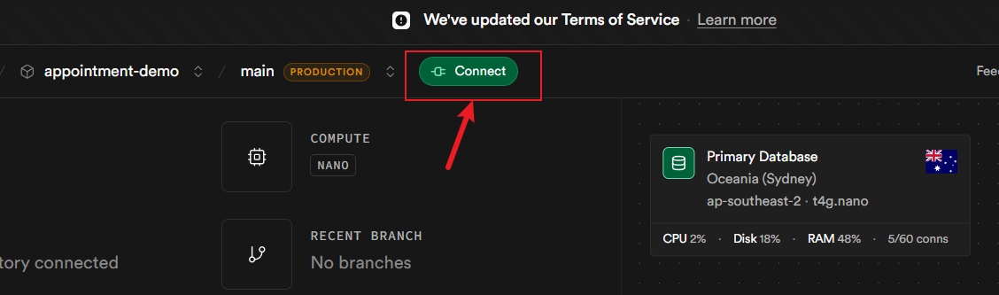

点击 `Connect` 后，在下面的页面中选择 `MCP`，在 Client 选项中选择 `Codex`

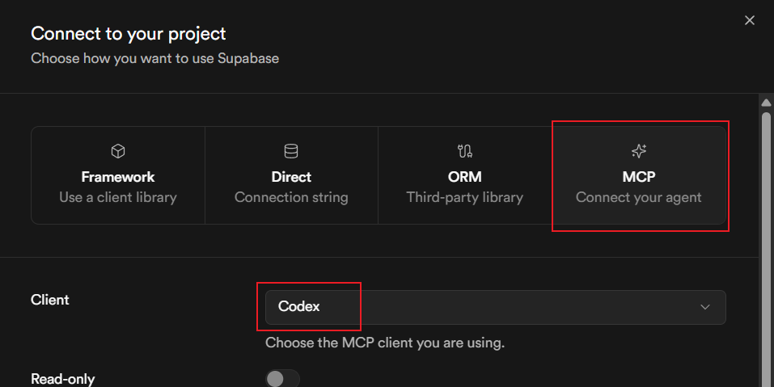

然后复制下面的 URL。


然后在 Codex app 中点击 `Settings` -> `MCP servers` -> `Add server`。然后选择 `Streamable HTTP`，将刚刚复制的 URL 粘贴到下面。这里可以将在 `Name` 填为 `Supabase MCP`。


注意这里，我们填入的 `Supabase MCP` 自动变成了 `supabase_mcp`。

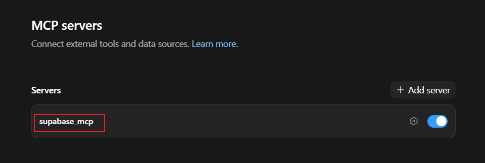

然后我们打开终端，输入登录命令 `codex mcp login supabase_mcp`。注意不是 `Supabase MCP`。

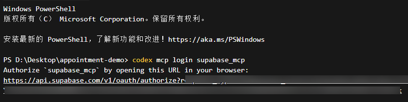

> 如果这一步终端报错的话，可能是你没有配置环境变量。
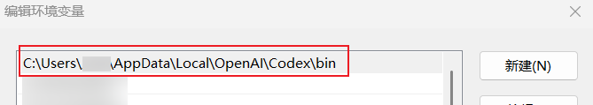
添加完环境变量后需要重启 Codex app。

登录命令输入完成后，浏览器会弹出授权窗口。

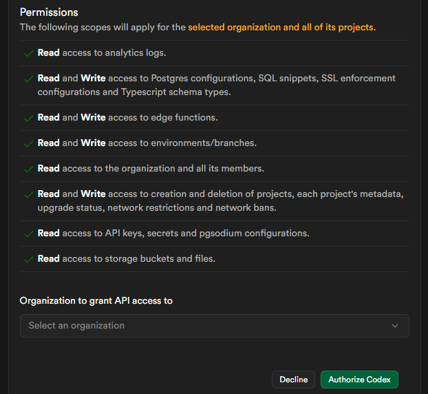

授权完成后，我们可以看到终端显示我们已经成功地登录了 MCP server `supabase_mcp`。

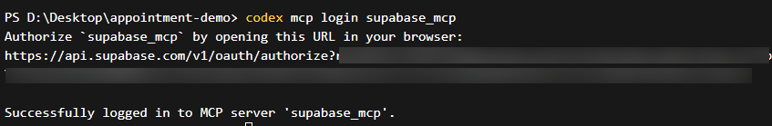

授权成功后，我们需要重启 Codex app。

下面我们开始使用 `supabase_mcp`，在对话框中输入 `使用 supabase_mcp 创建预约表`。

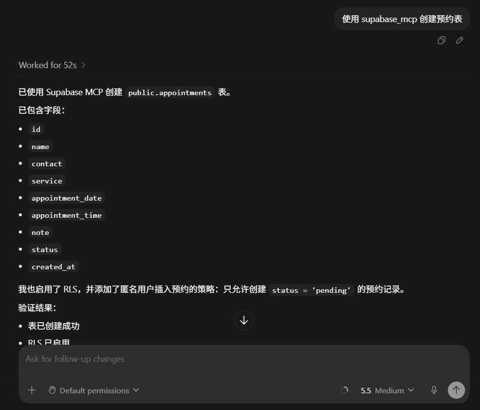

打开 Supabase 的网页，我们可以看到预约表确实被创建了。

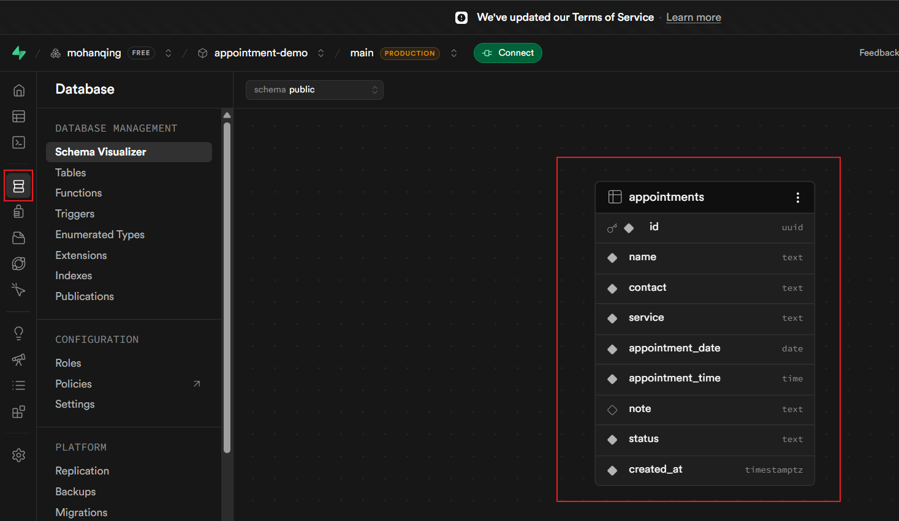

接下来我们来验证预约应用，在我们的预约应用中填入信息，并提交表单。

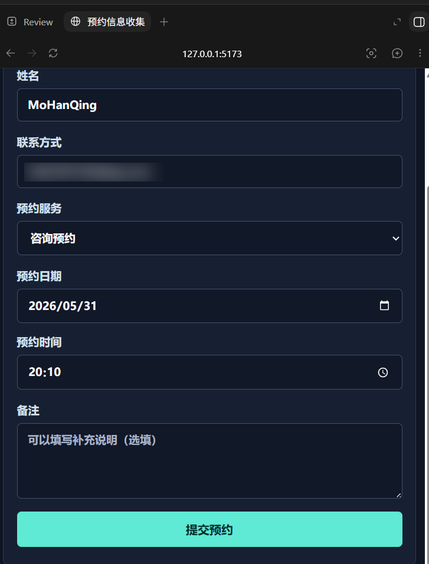

然后查看 Supabase，可以看到这条数据已经被插入了数据库。 

> 当然，如果在这过程中遇到了 Bug，你可以让 Codex 帮你解决。

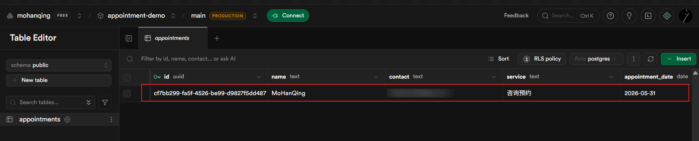

<hr style="border: none; height: 2px; background: linear-gradient(to right, transparent, #007bff, transparent);">

## 十二、Actions

到目前位置，你可能已经厌烦了在终端中敲启动命令。

你可以用常用动作（actions）定义一些高频任务，例如启动开发服务器或运行测试，其意义在于减少反复输入那些常见命令。

这些动作会显示在 Codex App 顶部栏里，便于快速触发。它们会在应用的集成终端中运行。

我们在 `Settings` 中选择 `Environments`，然后选择我们的项目。

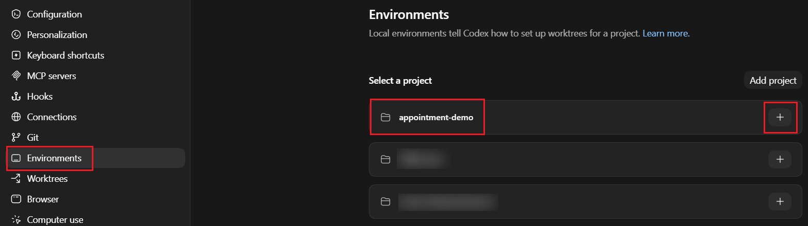

找到 `Actions`，点击 `Add action`。

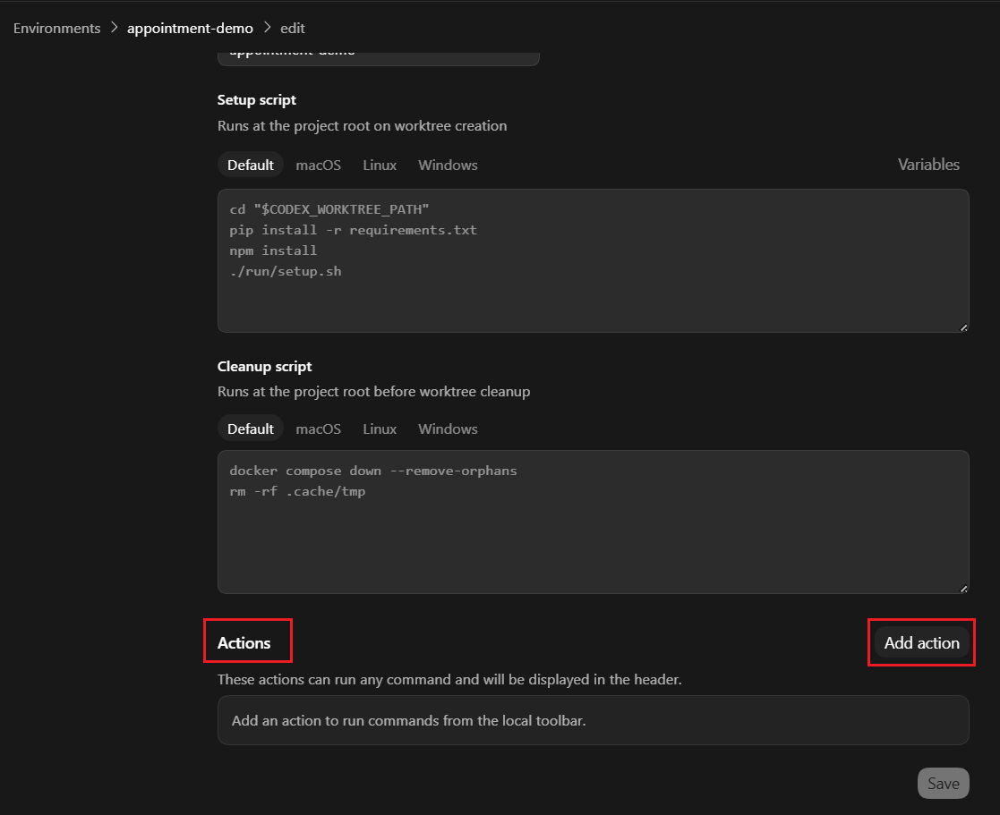

我们给这个 action 选择一个启动图标，命名为 `dev`，并在动作脚本中填写 `npm run dev`，最后点击 `Save`。

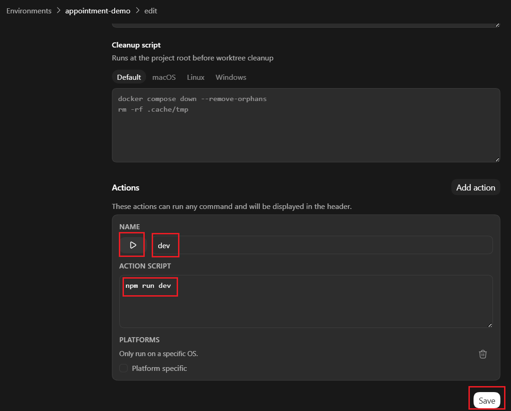

在 `Environment` 中选择我们的项目。

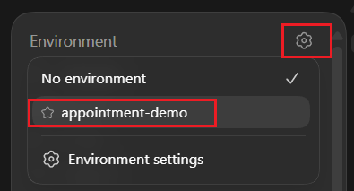

这样我们就可以点击那个启动图标来启动项目了。

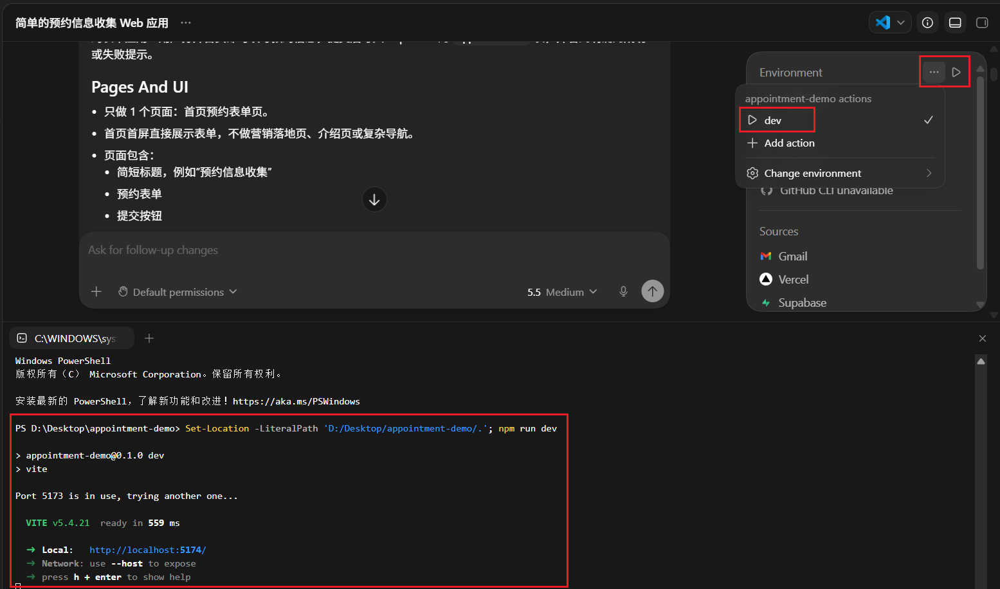

<hr style="border: none; height: 2px; background: linear-gradient(to right, transparent, #007bff, transparent);">


## 十三、Review

现在，预约信息已经可以成功写入 Supabase 数据库了。应用的核心功能已经完成，在继续部署之前，我们先让 Codex 对当前项目做一次 Review，检查是否还存在明显问题。

例如，对于本教程中的预约信息收集应用，我们可以告诉 Codex：

```
请 review 当前项目，重点检查：
1. 是否存在明显 bug
2. 表单提交和 Supabase 写入流程是否可靠
3. 是否有安全风险
4. 是否缺少必要的错误处理
5. 是否有不适合部署的问题
```

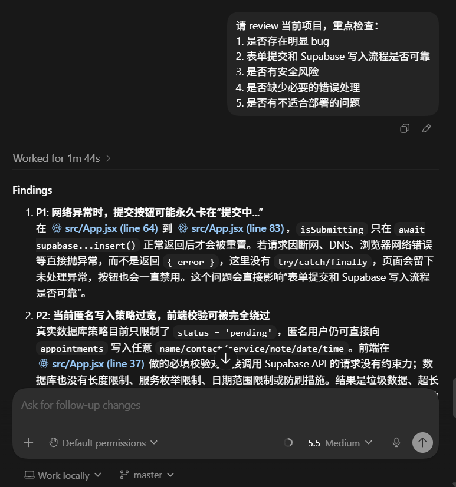

通过 Review，我们可以在应用上线前先发现一部分问题，减少后续返工。

当然你也可以手动 Review。

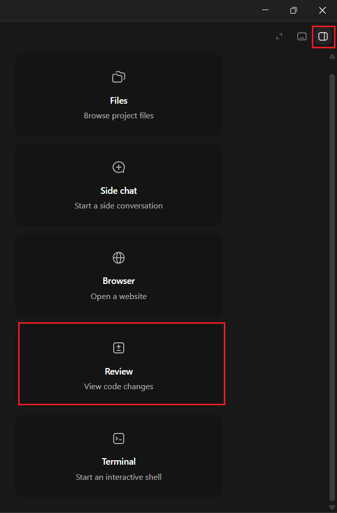

找到需要修改的位置，点击 `+`，然后输入 Comment，告诉 Codex 如何修改。

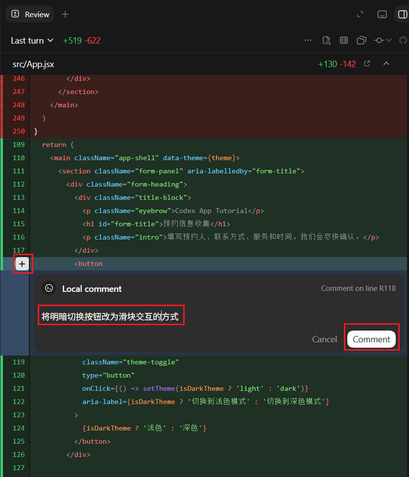

点击提交 Comment 后，可以看到这个 Comment 会被添加到输入框中，你可以发送这个消息，让 Codex 参考这个 Comment 今昔修改。

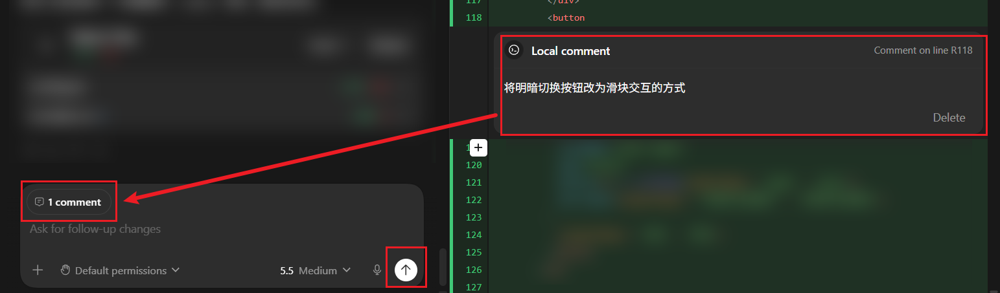

<hr style="border: none; height: 2px; background: linear-gradient(to right, transparent, #007bff, transparent);">

## 十四、Plugin

完成代码检查后，我们已经拥有了一个可以正常运行的预约应用。接下来，如果我们希望让 Codex 参与本地项目之外的工作流，例如将应用部署到 Vercel，就需要使用 Plugin。

### 14.1 什么是 Plugin

Plugin 可以理解为是给 Codex 增加额外能力的扩展。Codex 默认可以读取本地文件、修改代码、运行命令，但如果我们希望它进一步参与 GitHub、Vercel、Figma 等外部平台上的工作流，就可以通过 Plugin 扩展它的能力。

### 14.2 Plugin 与 MCP 的区别

如果说 MCP 更偏向于让 Codex 连接工具和数据源，那么 Plugin 更像是为 Codex 安装一个面向具体产品或工作流的扩展能力。

插件会把技能、应用和 MCP server 打包成可复用的工作流，供 Codex 安装和调用。

一个插件可以包含：
- 技能： 面向特定任务的可复用指令。Codex 会在需要时加载它们，从而遵循正确步骤，并使用对应的参考资料或辅助脚本。
- 应用： 连接 GitHub、Slack、Google Drive 等工具，让 Codex 能读取这些工具中的信息，并在其中执行操作。
- MCP server： 为 Codex 提供额外工具或共享上下文的服务，通常来自本地项目之外的系统。

### 14.3 使用 Vercel Plugin 部署应用

我们点击 Codex app 右侧功能区的 `Plugins`，然后在搜索 `Vercel` 插件，点击安装。安装完成后浏览器会自动弹出登录界面。

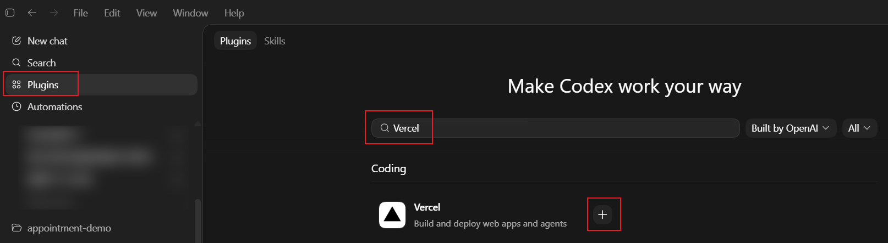

你可以使用 `@` 调用插件，例如：

```
请使用 @ Vercel 帮我部署当前应用。
```

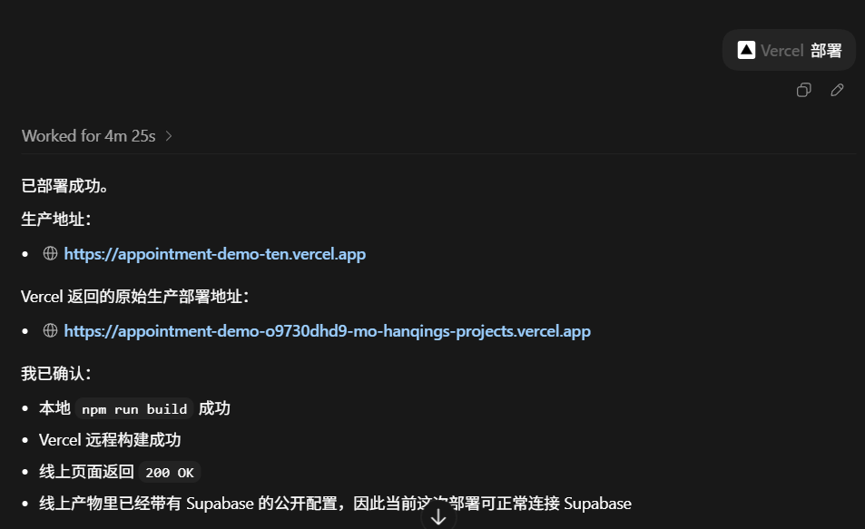

部署成功后，我们点击 Code 返回的应用公网地址，查看是否部署成功。

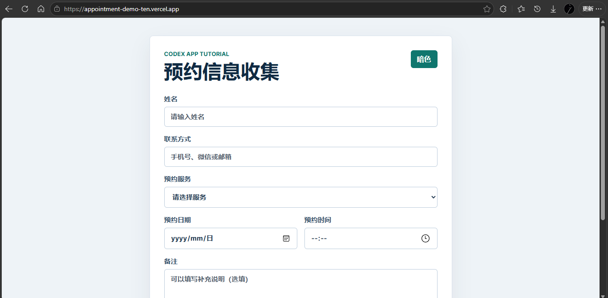

<hr style="border: none; height: 2px; background: linear-gradient(to right, transparent, #007bff, transparent);">

## 十五、Automation

你可以把重复性任务交给自动化任务在后台执行。

Automation 适合用于：
- 在未来某个时间提醒你继续某项工作
- 定期检查项目状态
- 定期生成摘要或报告
- 处理一些重复、规律性的工作

```
每天上午 9 点检查 appointment-demo 的最新 Vercel 部署状态。
如果部署成功，给我发送一封简短邮件，说明当前线上地址和最近一次部署时间；
如果部署失败，也发送邮件，并附上失败原因摘要。
```

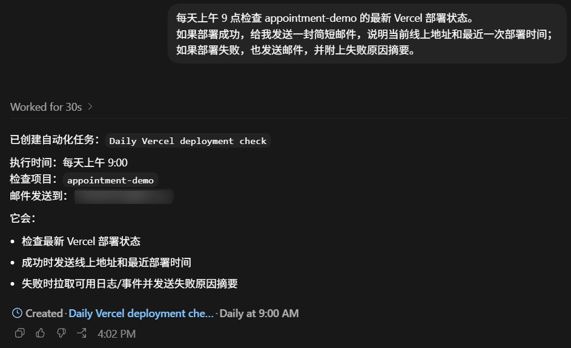

>这里需要下载 Gmail 插件，当然如果你无法使用 Gmail， 你可以更改自动化的操作，将处理结果写入一个文件中，来验证自动化。

你可以在 `Automations` 中找到你创建的自动化。

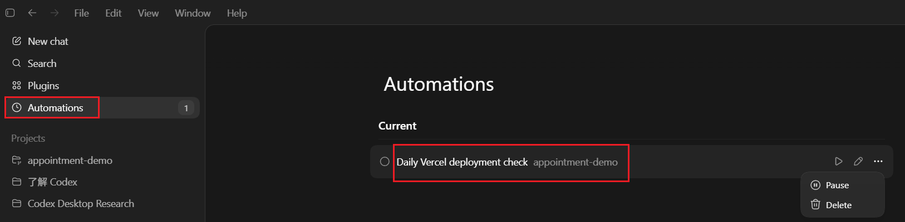

<hr style="border: none; height: 2px; background: linear-gradient(to right, transparent, #007bff, transparent);">


## 十六、工作树 WorkTree

### 16.1 什么是 WorkTree

工作树的概念源自于 Git。你可以将工作树理解为工作目录，也就是你能在磁盘中看到、能写代码的那个项目文件夹。

在创建完 Git 仓库，并且没有创建额外的工作树前，会有一个主工作树，这个主工作树就是我们最初创建仓库时对应的工作目录。

我们知道，一个工作目录在同一时刻只能处于一个分支上（或者处于分离头指针 `detached HEAD` 状态，即头指针指向具体的提交），那么，如果我们想在这个工作目录中并行的执行多项工作就会遇到困难，比如修改一个分支上的 Bug，并同时在另一个分支上增加新的功能。

这时我们就需要创建额外的工作树了，也就是创建多个独立的工作目录，这样每个工作目录就可以同时处于不同的分支，并行的执行任务了。注意，主工作树（主工作目录）和额外的工作树（额外的工作目录）之间是平级关系，而不是嵌套关系。

```
my-project/          # 主工作目录
my-project-feature/  # 额外 worktree
```

这些工作树是同一个 Git 仓库的多个工作目录，它们共享同一份 Git 历史记录。

在项目文件层面，不同的工作树之间彼此是独立的，一个工作树中对一个文件的修改，不会影响另一个工作树的文件，因为在前面提到过，工作树是一个目录，是物理层面的，不同的工作树就是不同的目录，在磁盘中保存在不同的地址空间中。

另外，默认情况下，在 Git 中同一个分支通常不能同时被多个工作树使用，从而避免你在多个目录里同时修改同一个分支，减少混乱。


工作树的价值在于我们可以让不同的 Codex 任务在不同的工作目录中并行执行，互不干扰，这样即使某个方向不满意，也不会影响主项目目录中的代码。

例如：
- 一个 WorkTree 用来修复 bug
- 一个 WorkTree 用来尝试新的 UI 方案
- 一个 WorkTree 用来验证某个实验性功能

### 16.2 创建工作树

#### 16.2.1 Create permanent worktree

`Create permanent worktree` 是从**项目**创建一个长期存在的 worktree，并把它作为一个新的项目放到侧边栏里。


在项目列表中点击项目右侧的 `...`，可以看到 `Create permanent worktree` 选项。


这里我们创建一个工作树。 这里要注意，worktree 是基于 Git 的，当你使用 Codex 创建 worktree 时，需要确认要基于的分支、HEAD 提交以及未提交改动状态，**避免 Codex 在错误的代码基线上创建隔离工作树**。

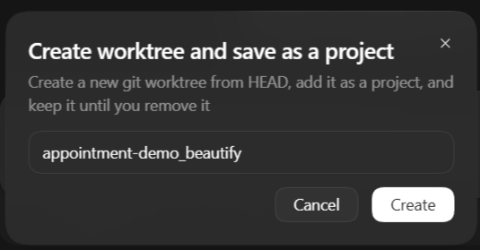


Codex 从当前 Git 分支/提交，也就是当前 HEAD，创建一个新的工作树副本，然后把这个新工作树作为一个独立项目加入 Codex的项目列表中，之后可以单独打开和使用。

可以看到，在 Projects 列表中增加了一项。

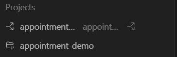

我们在终端中输入 `git worktree list` 来查看我们创建的工作树。

这两个分别是同一个 Git 仓库的两个工作树，第一个是主工作树，当前挂在 master 分支上；第二个是我们刚刚使用 Codex 创建的额外工作树，当前和主工作树指向同一个提交 d986ecb，但处于 detached HEAD 状态，也就是还没有绑定到具体分支。


我们可以先在 detached HEAD 的额外工作树里改代码，等满意后，再创建分支、提交或合并回主分支。

我们可以新创建的工作树中让 Codex 帮忙修改界面的样式。这里我已经修改完成了。

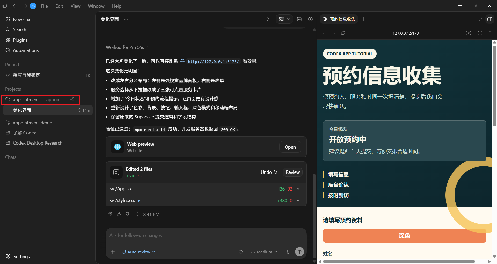

修改完成后，我们可以去查看一下我们的主工作树，可以看到主工作树没有受到影响，因为工作树之间是物理隔离的。

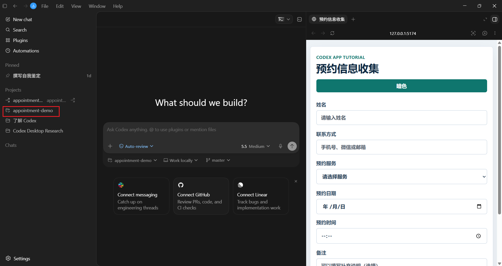

#### 16.2.2 Fork into new worktree

> 这一小结写于2026年5月20日，`Fork into new worktree` 在 Codex app 中仍然存在 Bug，表现为 Codex 会新建 worktree，但是在 chat 列表中没有新增会话。所以这里我将只做简单的介绍。

在前面的 Chat 章节中，我们已经看到右键点击某个对话时，会出现 `Fork into local` 和 `Fork into new worktree` 这两个选项。

`Fork into new worktree` 是从**当前聊天线程**分叉出一个新聊天，并让这个新聊天跑在一个新的 Codex 管理的 worktree 里。


#### 16.2.5 Fork into local

`Fork into local` 会将 Codex 对话复制一份，保留聊天上下文，但让新对话在你本地原项目目录里继续，而不是创建新的 worktree。


当然，你也可以在会话中的任意消息的位置进行 `Fork into new worktree` 或 `Fork into local`，

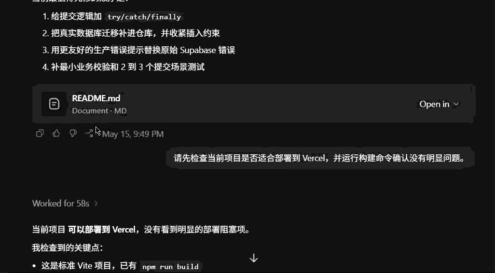

#### 16.2.4 使用区别

如果你想为某个项目创建一个长期隔离环境，比如 appointment-demo-feature-a，以后经常进去、开多个聊天，那么就用 `Create permanent worktree`。

如果你正在一个聊天里聊到一半，想复制当前上下文，但换到一个隔离 worktree 里继续试另一条路线，那么可以使用 `Fork into new worktree`。

如果你在 Codex 的里聊到一半，觉得这套上下文可以在项目目录中继续用，就可以用 `Fork into local`。

### 16.4 合并

如果你对结果满意，可以创建分支、提交、合并回主分支。

>当然，一下操作你都可以让 Codex 帮你完成。

这里我们先在新创建的工作树的会话界面中创建一个分支并提交。

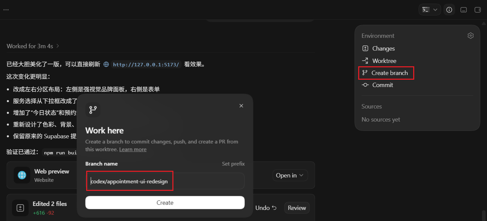

然后回到主工作树，在终端中输入 `git branch` 查看当前所在的分支，这里可以看到我们当前所在的分支是 `codex/appointment-ui-redesign`，由于我们的目标是将 `codex/appointment-ui-redesign` 分支合并到 `master` 分支，所以我们需要输入 `git switch master` 切换到 `master` 分支，然后执行 `git merge codex/appointment-ui-redesign` 合并分支。


这里会弹出你的默认编辑器，你可以在其中输入你的 commit，然后关闭编辑器。当然，你也可以什么也不动，直接关闭编辑器。

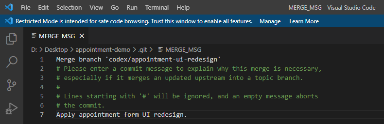

关闭编辑器后，Git 会进行合并。

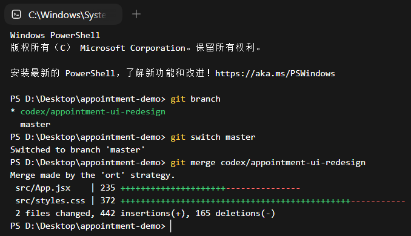

你可以输入 `git log` 来查看合并结果。

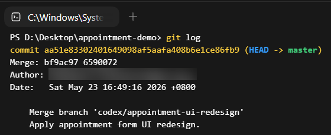

你可以在主工作树中重新启动项目来查看有没有问题。

<hr style="border: none; height: 2px; background: linear-gradient(to right, transparent, #007bff, transparent);">


## 十七、Browser Use

> 由于当前 Windows 环境中 Browser Use 暂时无法使用，这里仅作为补充能力介绍。

除了我们自己手动在内置浏览器中查看页面，也可以让 Codex 使用浏览器自动执行一些简单操作，例如打开页面、填写表单、点击按钮、观察结果。

例如，在 Web 应用开发中，我们可以让 Codex：
- 点击页面按钮
- 填写表单
- 查看页面反馈
- 根据页面结果判断功能是否正常

## 十八、Computer Use

> 由于当前 Windows 环境中 Computer Use 暂时无法使用，这里仅作为补充能力介绍。

如果说 Browser Use 主要面向网页，那么 Computer Use 面向的是更广泛的电脑界面。它可以让 Codex 观察屏幕、点击按钮、输入文字、操作应用窗口，从而完成一些跨应用、跨界面的任务。

Computer Use 可以帮助 Codex 执行一些需要图形界面参与的任务，例如：
- 打开某个桌面应用
- 点击界面中的按钮
- 在输入框中输入内容
- 根据屏幕内容判断下一步操作